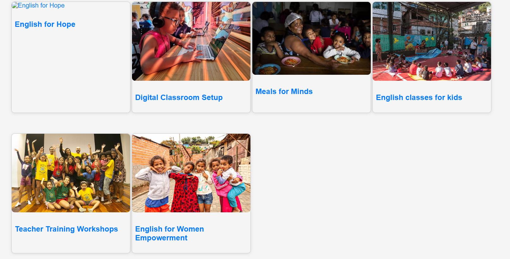
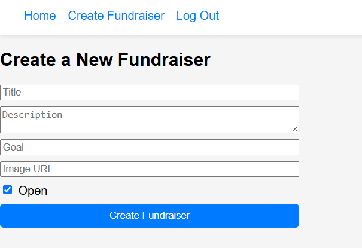
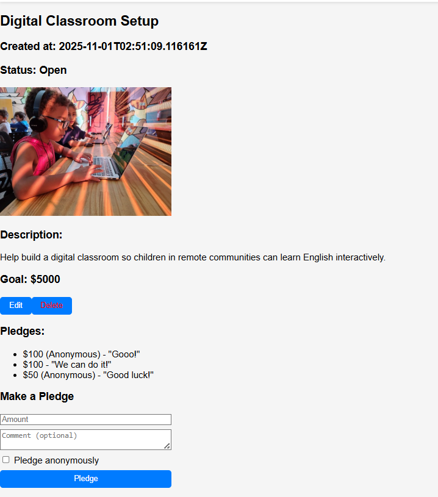

# English for Hope - Crowdfunding App

English for Hope is a simple crowdfunding web application where users can create fundraisers, make pledges, and support meaningful causes.

---

## Deployed Project

You can view the live frontend here:  
[English for Hope - Frontend](https://69077d91351e06b1e3798b41--cheerful-chebakia-e10391.netlify.app/)  

---

## Screenshots

### Homepage

./

### Fundraiser Creation Page
Shows the full page where a user can create a fundraiser.  

### Fundraiser with Pledges
Shows a fundraiser page with pledges and comments from supporters.  

